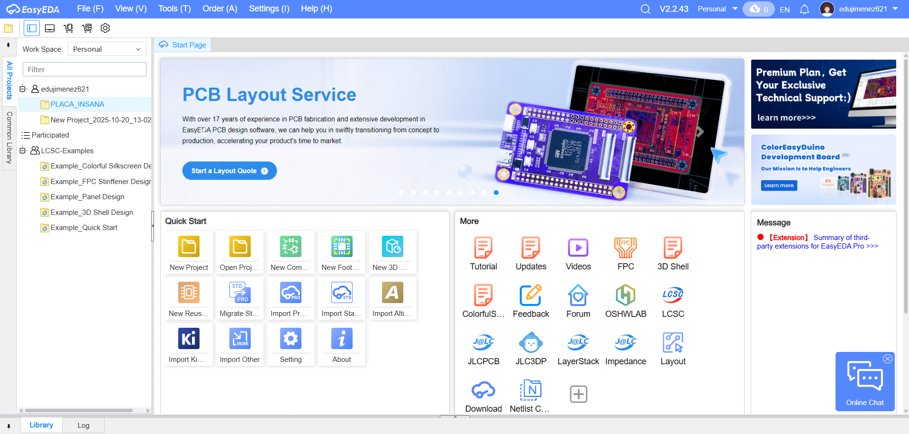
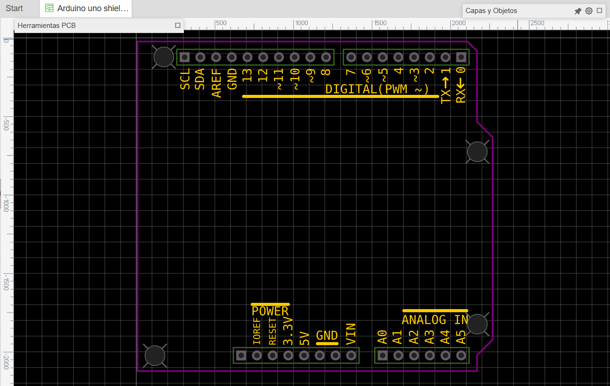
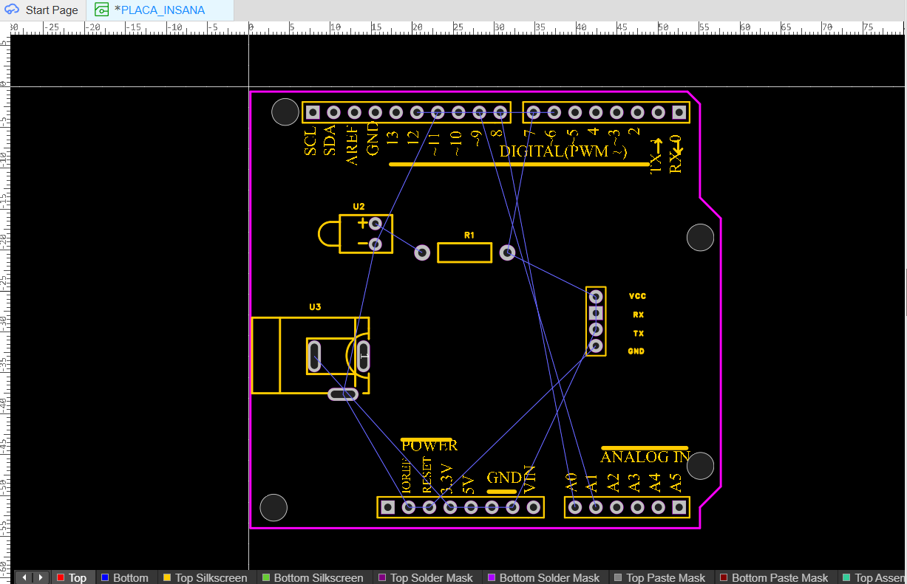
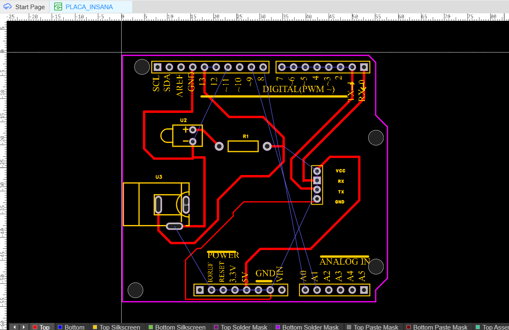
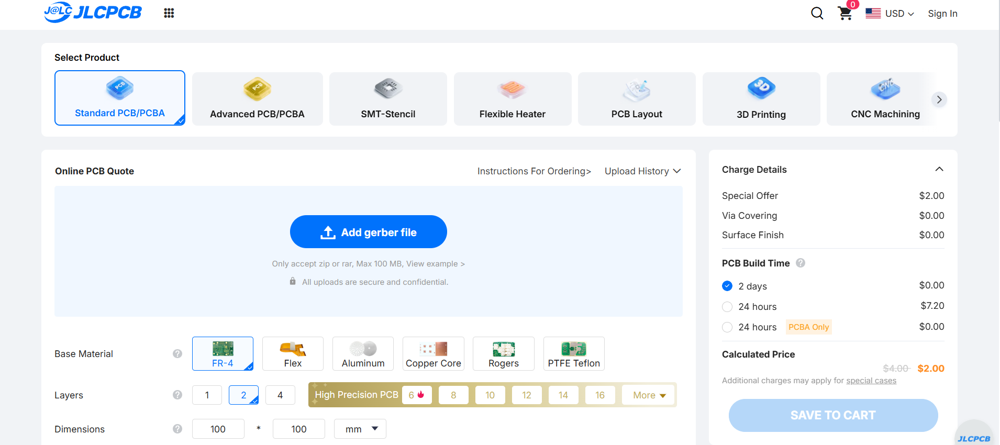
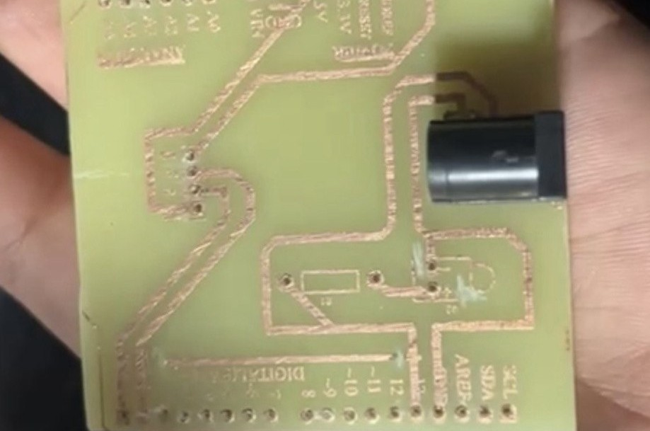
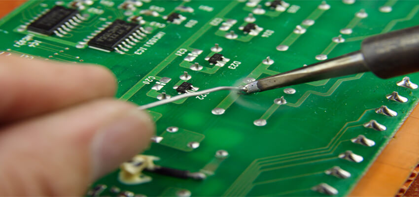

# Guía para el Diseño y Fabricación de una PCB

En esta guía aprenderás paso a paso cómo **diseñar y fabricar una placa de circuito impreso (PCB)**, utilizando la herramienta **EasyEDA** para el diseño digital y dos métodos de fabricación: **industrial** mediante archivos Gerber y **manual** con transferencia térmica y cloruro férrico.

---

## 1. Diseño de la PCB con EasyEDA

**Instalación del software**

EasyEDA es una plataforma gratuita para diseño electrónico que ofrece tanto un *editor en línea* como una *versión descargable*.  
Puedes acceder desde: [https://easyeda.com](https://easyeda.com)

Al crear una cuenta, podrás diseñar tus esquemas eléctricos, generar el trazado de la PCB y exportar tus archivos listos para fabricar.

> 💡 **Consejo:** si trabajas en distintos dispositivos, utiliza la versión en línea para mantener tus proyectos sincronizados en la nube.

---

## 2. Descarga del shield para Arduino Uno

Para facilitar el diseño, inicia con un **modelo base de shield** compatible con **Arduino Uno**.  
Puedes encontrarlo en la biblioteca de EasyEDA:

1. Ve a **Libraries > Modules > Arduino Shield**.  
2. Importa el modelo a tu proyecto.  
3. Guárdalo como plantilla para futuras modificaciones.

Esto servirá como base para ubicar tus componentes y conectar tus señales.

---

## 3. Edición del diseño

En esta etapa agregarás los componentes necesarios para tu proyecto:

1. Abre la librería de componentes desde el panel lateral.  
2. Busca los elementos requeridos (resistencias, capacitores, conectores, etc.).  
3. Coloca los componentes en posiciones lógicas y ordenadas.  

> 📏 **Recomendación:** agrupa los componentes por función (alimentación, control, sensores, etc.) para minimizar cruces de pistas.

---

## 4. Conexión mediante pistas (Tracks)

Con los componentes ubicados, traza las **pistas eléctricas** que los interconectan:

1. En el menú superior, selecciona:  
   `Herramientas PCB > Track (Pistas)`
2. Conecta cada pin siguiendo tu diagrama esquemático.  
3. Verifica cuidadosamente las siguientes conexiones:
   - **VCC (5V)**: conexión a la fuente de alimentación del Arduino.  
   - **GND (Tierra)**: unión con el plano de tierra.  
   - **TX / RX**: comunicación serial (si aplica).  
   - Otras señales específicas de tu proyecto.

> ⚙️ Mantén las pistas lo más cortas posibles y evita ángulos de 90°, ya que dificultan el grabado químico y pueden generar ruido eléctrico.

---

## 5. Configuración final del diseño

Antes de exportar o fabricar la PCB, verifica los siguientes parámetros:

- **Ancho de pistas:** ajusta el grosor según la corriente que transportarán (recomendado: ≥0.4 mm para señales y ≥1 mm para alimentación).  
- **Opacidad:** asegúrate de que todas las pistas y pads tengan **opacidad del 100%** (sin transparencia).  
- **Capa superior:** coloca todas las pistas en la capa **Top Layer** si planeas fabricar de forma manual.  
- **Distancia mínima:** deja al menos **0.3 mm** entre pistas para evitar cortocircuitos durante el grabado químico.

---

## 6. Guardado del proyecto

Guarda tu diseño desde el menú:  

Puedes también guardar el esquema eléctrico asociado para futuras modificaciones.  
EasyEDA guarda automáticamente una copia en la nube si estás conectado a tu cuenta.

---

## 7. Preparación para fabricación

### 🔸 Fabricación industrial

Para enviar tu diseño a una fábrica profesional:

1. En EasyEDA, dirígete a:  
   `Fabricación > Archivo fabricación PCB (Gerber)`
2. Descarga el archivo `.zip` con los **archivos Gerber**.  
3. Sube ese archivo al sitio de un fabricante, como [JLCPCB](https://jlcpcb.com), [PCBWay](https://pcbway.com) o similar.
4. Selecciona el tamaño, número de capas, color del solder mask, grosor, y realiza el pedido.

---

### 🔸 Fabricación casera

Si deseas realizar tu PCB manualmente, sigue cuidadosamente los siguientes pasos:

#### 1️⃣ Exportar el diseño
- En EasyEDA, selecciona **Archivo > Exportar como PDF**.  
- Asegúrate de que el **escala sea 1:1** (sin ajuste automático).  
- Verifica que las pistas tengan **opacidad al 100%** para lograr un contraste fuerte al imprimir.

#### 2️⃣ Impresión del diseño
- Imprime el diseño sobre **papel transfer** o **papel satinado** utilizando una impresora láser.  
- Evita impresoras de inyección de tinta, ya que la tinta no se transfiere correctamente.

#### 3️⃣ Transferencia térmica
- Coloca el papel impreso sobre una **placa de cobre limpia y lijada**.  
- Usa una **plancha caliente (sin vapor)** durante unos minutos aplicando presión uniforme.  
- Cuando el diseño se haya adherido bien, deja enfriar la placa y retira con cuidado el papel.  
El tóner quedará adherido al cobre, formando las pistas del circuito.

#### 4️⃣ Grabado químico
- En un recipiente plástico, vierte **cloruro férrico (FeCl₃)**.  
- Sumerge la placa y agita suavemente para acelerar la reacción.  
- Espera hasta que el cobre no cubierto por el tóner se disuelva completamente.

> ⚠️ **Precaución:** utiliza guantes, gafas protectoras y trabaja en un área ventilada. El cloruro férrico es corrosivo.

#### 5️⃣ Limpieza final
- Retira la placa del ácido y enjuágala con abundante agua.  
- Con un cepillo y alcohol isopropílico, limpia la superficie para eliminar los restos de tóner.  
- Deberán quedar visibles solo las **pistas de cobre**.

#### 6️⃣ Perforación y soldadura
- Realiza los agujeros con un mini taladro según el tamaño de los pines.  
- Coloca y suelda cada componente en su posición correspondiente.  
- Revisa que las soldaduras sean limpias, brillantes y sin puentes.

#### 7️⃣ Pruebas eléctricas
- Conecta la PCB a la fuente de alimentación o al Arduino.  
- Mide las tensiones y verifica continuidad entre las pistas.  
- Si todo está correcto, la PCB está lista para usarse.

---

## 8. Ensamblaje y soldadura de componentes

Durante el ensamblaje final:

1. Inserta los componentes en sus respectivas posiciones según el diseño.  
2. Suelda primero los componentes más pequeños (resistencias, jumpers, etc.) y deja los más grandes para el final.  
3. Evita aplicar calor excesivo para no dañar las pistas.  
4. Limpia los residuos de flux con alcohol isopropílico.

---

## 9. Prueba final

Conecta la placa a la alimentación y realiza las pruebas funcionales.  
Comprueba continuidad, polaridad y señales.  
Si todo funciona según lo previsto, ¡has completado exitosamente tu PCB! 🎉

---

> 💾 **Consejo final:** guarda tus archivos Gerber, el PDF de impresión y el proyecto EasyEDA en una carpeta organizada para futuras modificaciones o duplicaciones del diseño.
